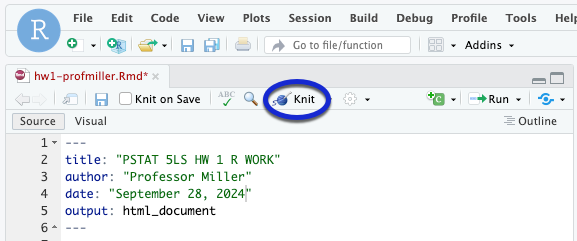
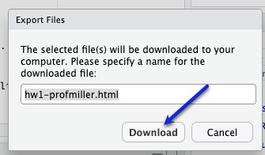

```{r setup, include=FALSE}
knitr::opts_chunk$set(echo = TRUE)
```

# Rename your Document

To avoid your work being overwritten, **rename** this file (`hw1.Rmd`). You could add your name to the file name (e.g., `hw1-profmiller.Rmd`).

To rename a file, check the box next to the file you want to rename. Click "Rename" in the files pane, rename the file, then click OK.


Your file will then appear with its new name.


# Introduction

Let's keep working with the `penguins` data set. Recall that this data set has information about 333 penguins collected from 3 islands in the Palmer Archipelago in Antarctica. Data were collected and made available by [Dr. Kristen Gorman](https://www.uaf.edu/cfos/people/faculty/detail/kristen-gorman.php) and the [Palmer Station, Antarctica LTER](https://pal.lternet.edu/), a member of the [Long Term Ecological Research Network](https://lternet.edu/), and the data were prepared by [Dr. Allison Horst](https://github.com/allisonhorst/palmerpenguins).

For Homework 1 Question 8, you will produce numerical and graphical displays to investigate and compare the body masses (in grams) of the Palmer penguins.

## Read in the Data

First, we need R to read in the data. Run the code in chunk below to import ("read in") the data in `penguins.csv` and call it `penguins`. Refer back to the lab slides if you need a reminder about how to run a code chunk.

```{r readData, error = T}

penguins <- read.csv("penguins.csv", stringsAsFactors = TRUE)

```

## Question 1

First let's look at a histogram and summary statistics of body mass for all 333 penguins.

The following chunk has the code to create a histogram of the body masses. Notice that the code includes arguments to create a title (`main`), an x-axis label (`xlab`), a y-axis label (`ylab`). Go ahead and run this chunk.

```{r hist_body_mass, error = T}
hist(penguins$body_mass_g, 
     main = "Histogram of Body Mass of Palmer Penguins", 
     xlab = "Body Mass (grams)", 
     ylab = "Number of Penguins")
```

Describe the shape of the distribution of body mass for the Palmer penguins. (Here you want to comment on the number of modes and symmetry/skew.)

*Replace this text with your answer to Question 1*

## Question 2

In this question, we will find summary statistics for the body masses of the Palmer penguins.

The following chunk has the code to get the summary statistics and the standard deviation (because R is silly and doesn't give the standard deviation with `summary()`). Go ahead and run this chunk.

```{r summary_stats, error = T}
summary(penguins$body_mass_g)
sd(penguins$body_mass_g)

```

Look back at the histogram of the body masses. Based on what you observe, which of the mean or the median is the best measure of center for the distribution of body masses? What is the value of this measure of center? Briefly explain why you chose this measure of center.

*Replace this text with your answer to Question 2*

## Question 3

Let's compare the body masses by species of penguin by making side-by-side box plots of the quantitative variable `body_mass_g` by the categorical variable `species`.

To do this, you can copy the code that we used to make side-by-side box plots in Lab 1 and then make the appropriate changes to the variable, `main`, `xlab`, and `ylab`.

```{r boxplots_body_mass, error = T}
# Use this code chunk to write the code necessary to answer the question. Do not start your code on this line, and do not start your code with # (this is a comment, R will ignore it).


```

Now run the following code chunk so that you can see the summary statistics for body mass for the three species of penguins.

```{r summary_by_species, error = TRUE}

tapply(penguins$body_mass_g, penguins$species, summary)

tapply(penguins$body_mass_g, penguins$species, sd)

```

Does it appear body mass differs by species? Comment on similarities and differences that you see, being sure to address aspects of what you see in the side-by-side box plots and the summary statistics to support your answers.

*Replace this text with your answer to Question 3.*

<hr />

# Wrap-Up and Submission

At the top of the document, make sure you've changed the `author` field to your name (in quotes!) and the `date` field to today's date.

When you've finished your data analysis, click the **Knit** button one last time.<br />

{width="75%"}


### Submission instructions

```{=html}
<!-- This is a comment and will not show up in your document. Note that the
numbering here is all 1's. This will automatically be converted to 1, 2, etc.
when you knit the document; writing all 1's makes it so you don't have to
constantly update the numbering when you move things around in editing! -->
```
1.  In the Files pane, check the box next to your `hw1.html`: </br>

{width="50%"}

2.  Click More → Export... </br>

{width="50%"}

</br>

3.  Click Download and save the file on your computer in a folder you'll remember and be able to find later. You can just call the file `hw1-yourname.html` or whatever else you'd like (as long as you remember what you called it).

{width="50%"}

Now upload the HTML as your answer to Question 8.1 of HW 1 in Gradescope.
